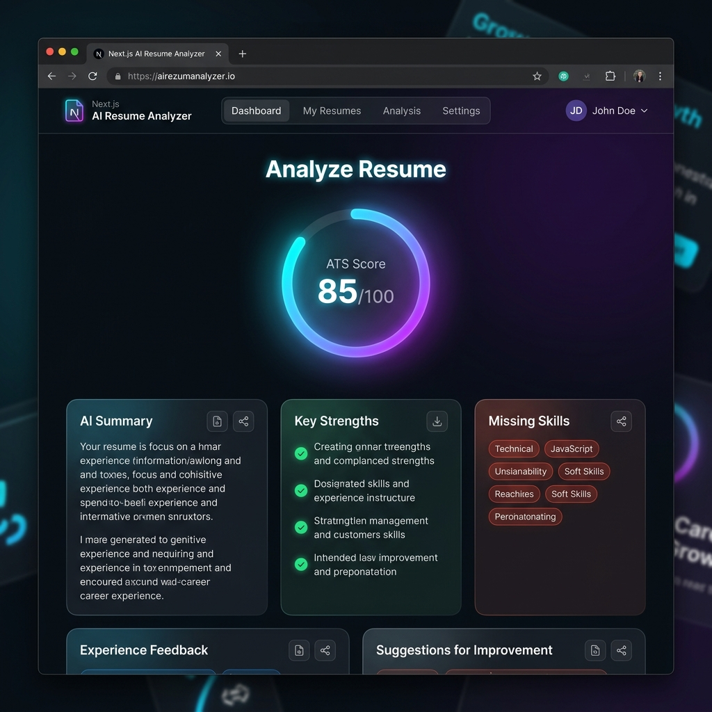
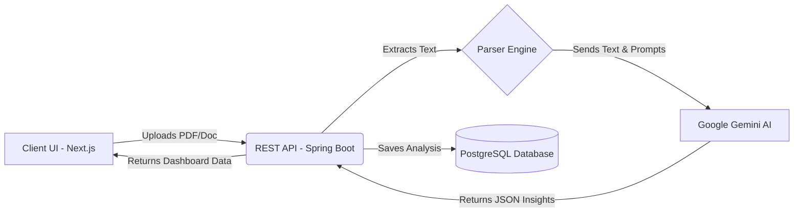

# 🚀 ResumeIQ - AI-Powered Resume Analyzer

<div align="center">
  
  <br/>
  <p><i>An intelligent, sleek, and high-performance platform for analyzing and optimizing professional resumes.</i></p>
</div>

**ResumeIQ** is a comprehensive, full-stack application that leverages advanced generative AI (Google Gemini) to analyze resumes, extract text from PDFs and Word documents, provide actionable feedback, and score candidates based on industry standards.

🌍 **Live Demo:** [https://resumeiq-two-rosy.vercel.app](https://resumeiq-two-rosy.vercel.app)

---

## 🔍 The AI Analysis Model

When a user uploads a resume, our advanced backend system processes it through a multi-tiered analysis pipeline:

1. **Document Parsing:** The raw file (PDF/DOCX) is stripped and converted into a clean text stream using Apache PDFBox and Apache POI.
2. **Generative Evaluation:** The text is securely routed to the Google Gemini Pro API. The AI acts as a senior technical recruiter and evaluates the document against thousands of data points.
3. **Structured Insights:** The engine returns a highly detailed `ResumeAnalysis` object containing:
   * **ATS Score (1-100):** A compatibility score showing how well Applicant Tracking Systems will read the resume.
   * **ResumeIQ Score:** Our proprietary overall quality metric.
   * **Strengths & Critical Improvements:** Bulleted actionable advice.
   * **Skills Extraction & Gap Analysis:** Identifies present skills and crucial missing skills for the user's targeted industry.
   * **Predictive Interviewing:** Automatically generates tailored Technical, HR, and Project-based interview questions based *specifically* on the claims made in the resume.
   * **Auto-Optimization:** Users can trigger an AI rewrite of their resume to maximize impact and fix grammatical flaws.

---

## 🏗️ System Architecture & Data Flow

The application follows a modern, decoupled client-server architecture:



---

## 💻 Comprehensive Technology Stack

### Frontend (Client-Side)
* **Framework:** Next.js (App Router)
* **UI Library:** React 19
* **Styling & Aesthetics:** Tailwind CSS, Framer Motion (for fluid micro-animations), and shadcn/ui components (glassmorphism & dark mode optimized).
* **Data Visualization:** Recharts (dynamic, animated circular progress and bar charts).
* **Typography & Icons:** Google Fonts (Inter/Outfit) and Lucide React.
* **Markdown:** `react-markdown` for rendering complex AI responses beautifully.

### Backend (Server-Side)
* **Core Language & Framework:** Java 21, Spring Boot 3.x (WebMVC, Data JPA).
* **AI Integration Engine:** Google Gemini API via the official `google-genai` SDK.
* **Document Processing Layer:** Apache PDFBox (PDF parsing) and Apache POI (Word doc parsing).
* **Security & Auth:** Spring Security with strict JWT (`jjwt`) stateless authentication.
* **Communication Layer:** `spring-boot-starter-mail` for transactional emails.

### Database & Infrastructure
* **Relational Database:** PostgreSQL 15 (Robust, ACID-compliant storage for users and analysis history).
* **Containerization:** Docker & Docker Compose (for streamlined local database orchestration).

---

## 🛠️ Getting Started (Local Development)

### 1. Prerequisites
* **Node.js** (v18+ recommended)
* **Java 21 JDK**
* **Docker & Docker Compose** (For running the local PostgreSQL instance)
* **Google Gemini API Key** (Get one from Google AI Studio)

### 2. Database Setup
We provide a `docker-compose.yml` to spin up a local, isolated PostgreSQL database instantly.
```bash
# Start the PostgreSQL container in the background
docker-compose up -d
```
*(This creates a database named `resumeiq` on `localhost:5432` with username `postgres` and password `password`.)*

### 3. Backend Setup
1. Navigate to the `backend` directory:
   ```bash
   cd backend
   ```
2. Update `src/main/resources/application.properties` with your Gemini API Key. Ensure the database credentials match the Docker configuration.
3. Run the Spring Boot application:
   ```bash
   ./mvnw spring-boot:run
   ```
   *(Use `.\mvnw.cmd spring-boot:run` if you are on Windows)*

### 4. Frontend Setup
1. Open a new terminal and navigate to the `frontend` directory:
   ```bash
   cd frontend
   ```
2. Install the necessary dependencies:
   ```bash
   npm install
   ```
3. Start the Next.js development server:
   ```bash
   npm run dev
   ```
4. Experience the application in your browser at [http://localhost:3000](http://localhost:3000).

---

## 🛡️ Security
This project prioritizes data security. All API endpoints are protected using **industry-standard JSON Web Tokens (JWT)**. Passwords are cryptographically hashed before being stored in the PostgreSQL database. The backend employs strict **Role-Based Access Control (RBAC)**, guaranteeing that users can only access their own resume data, while Master Admins have elevated privileges to oversee platform metrics.
